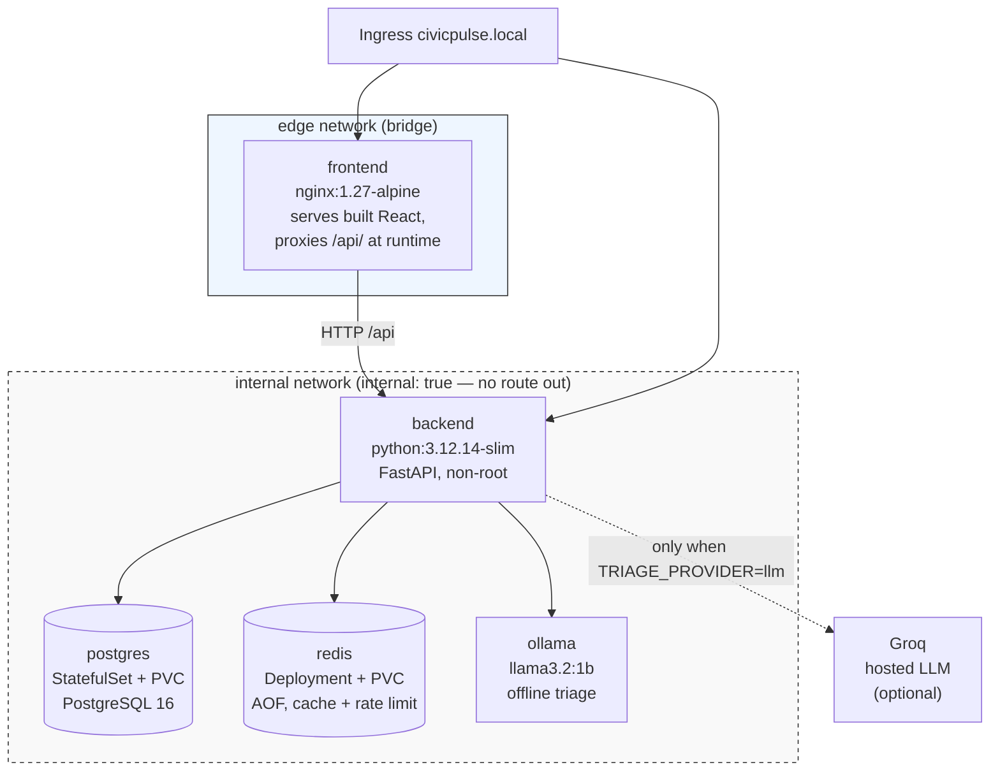

# CivicPulse

Municipal complaint intake, AI triage, and operations dashboard.

A citizen submits a complaint in free text. The system validates it, triages it
into a category / priority / one-line summary, persists it durably, and surfaces
it on a live operator dashboard with aggregate statistics — running as five
cooperating containers on a laptop, and as a scaled, probed, auto-scaling
workload on Kubernetes in CI.

The point of the project is not the reading. It is that **the reader must be
replaceable**: today a keyword rule, tomorrow a language model, next year a
fine-tuned classifier. The system around it must not care which, and must not
fall over when the clever one is rate-limited, slow, or simply wrong.

---

## Status

| Component | State |
|---|---|
| Backend (FastAPI, 4 layers) | 9/9 contract endpoints, 23 tests, coverage gate ≥ 65% |
| Frontend (React 18 + Vite + TS) | Submit / Dashboard / Stats, 5 component tests |
| Triage providers | `llm:groq`, `llm:ollama`, `rules`, `simulated` + `rules:fallback` |
| Docker / Compose | 2 images multi-stage non-root, 2 networks, 3 volumes |
| Kubernetes | Namespace, 2 Deployments, StatefulSet+PVC, 4 ClusterIP Services, Ingress, HPA, PDB, VPA |
| CI | 7 jobs + `CI` aggregate gate, all green on `dev` |
| CD | `test → build-push → deploy-k8s`, deploys by image digest on k3d |

Run the submission lint for the authoritative check:

```bash
python scripts/check_submission.py
```

---

## Architecture



**The segmentation is the demonstration.** `frontend` joins `edge` only;
`postgres`, `redis` and `ollama` join `internal` only; `backend` joins both and
is the only bridge. The frontend is the internet-facing component and therefore
the most likely to be compromised, so it has no route to your data.

This is verified rather than asserted.
[`docs/evidence/network-isolation.txt`](docs/evidence/network-isolation.txt)
captures raw TCP probes run from inside a real frontend pod in k3d: connections
to `postgres:5432` and `redis:6379` are **blocked** by
`k8s/base/network-policy.yaml`, while `frontend → backend:8000` returns `200`
and `backend → postgres` stays **allowed**. Re-run it yourself with the
commands at the top of that file.

That `internal: true` also means the backend cannot reach the internet, so a
hosted `llm:groq` call has nowhere to go. That trade-off and its resolution are
written up in [ADR 0004](docs/adr/0004-pii-and-data-governance.md) and
[ADR 0001](docs/adr/0001-provider-interface.md).

---

## Quickstart

### 1. Run it on your laptop

```bash
git clone https://github.com/khaliqtaimoor6-codes/CivicPulse.git
cd CivicPulse
cp .env.example .env
docker compose up -d --build
```

Then load the 30 seeded complaints (the seed is idempotent — running it twice
inserts nothing the second time):

```bash
docker compose exec backend python scripts/seed.py
```

Open **<http://localhost:80>**. Submit a complaint and watch the provider badge
on the response; open `/api/stats` twice and watch `X-Cache` go `MISS` then
`HIT`.

Triage defaults to `simulated` so this works with no API key and no model
download. For real local inference:

```bash
docker compose up -d ollama
docker compose exec ollama ollama pull llama3.2:1b   # ~1.3 GB, once
# set TRIAGE_PROVIDER=ollama in .env, then:
docker compose up -d backend
```

For a hosted model, set `TRIAGE_PROVIDER=llm` and put a free-tier Groq key in
`LLM_API_KEY` in `.env`. See [docs/TRIAGE.md](docs/TRIAGE.md) for measured
accuracy and latency of each path.

### 2. Run it on Kubernetes

```bash
k3d cluster create civicpulse
docker build -t civicpulse-backend:dev -t civicpulse-frontend:dev backend frontend
k3d image import civicpulse-backend:dev civicpulse-frontend:dev -c civicpulse
kubectl apply -k k8s/overlays/dev
kubectl rollout status statefulset/postgres -n civicpulse --timeout=180s
kubectl rollout status deployment/civicpulse-backend -n civicpulse --timeout=180s
kubectl get hpa -n civicpulse
```

Full deploy / rollback / log-reading instructions: [docs/RUNBOOK.md](docs/RUNBOOK.md).

---

## API

Base URL in development is `http://localhost:8000`; through the Ingress it is
`http://civicpulse.local/api`.

| Method | Path | Behaviour |
|---|---|---|
| `POST` | `/api/complaints` | Validate → triage → persist. `201`. `400` with field-level errors. `429` + `Retry-After` when rate limited. |
| `GET` | `/api/complaints` | Filter by `category`, `priority`, `status`; paginate with `page`, `page_size` (≤ 100); returns `total`. |
| `GET` | `/api/complaints/{id}` | `200` / `404`. Includes the cached triage result. |
| `PATCH` | `/api/complaints/{id}/status` | Enforces the transition table. Invalid transition → `409` naming the attempted transition. |
| `GET` | `/api/stats` | Aggregates by category and priority. Redis read-through cache, TTL 30 s, `X-Cache: HIT\|MISS`. Invalidated on write. |
| `GET` | `/api/meta/providers` | Active provider plus the last 20 triage outcomes (provider, latency ms, fallback y/n). |
| `GET` | `/health` | Liveness. **Must not touch the database** — a failing liveness probe restarts the pod. |
| `GET` | `/ready` | Readiness. `200` only if Postgres *and* Redis are reachable, `503` naming the failed dependency. |
| `GET` | `/metrics` | Prometheus text: request count, request latency histogram, triage latency, fallback counter. |

`/health` and `/ready` are separate on purpose: Kubernetes uses them for
different decisions. Wire them backwards and a slow database becomes a restart
loop across the whole deployment.

### Status state machine

Implemented as an explicit transition table in
`backend/app/services/complaint_service.py`, not a chain of `if`s:

```
open ──→ in_progress ──→ resolved
  │            │
  └────────────┴──→ rejected
```

`resolved` and `rejected` are terminal. Everything else returns `409`.

### Triage outcomes

`triaged_by` records who actually decided, which is what makes cost and
reliability measurable rather than asserted:

| Value | Meaning |
|---|---|
| `llm:groq` | Hosted model answered and passed schema validation |
| `llm:ollama` | Local model answered and passed schema validation |
| `rules` | Deterministic keyword rules decided directly |
| `rules:fallback` | The model was tried and failed; rules decided instead |
| `simulated` | Deterministic fake (CI and demos) |

A user never sees a `500` because a third party was rate-limited. The fallback
is a design property, not an error path.

---

## Engineering notes

Eight questions from the brief are answered with file-and-line references in
[docs/ENGINEERING-NOTES.md](docs/ENGINEERING-NOTES.md) — including where the
pipeline sits on the CI/CD maturity ladder, what "correct" means for a
probabilistic component, and the failure that cost the most time.

| Document | What it covers |
|---|---|
| [ENGINEERING-NOTES.md](docs/ENGINEERING-NOTES.md) | The eight questions, with references |
| [RUNBOOK.md](docs/RUNBOOK.md) | Deploy, roll back, read logs, triage degradation |
| [TRIAGE.md](docs/TRIAGE.md) | Provider comparison, measured accuracy and latency |
| [API-CONTRACT.md](docs/API-CONTRACT.md) | Full request/response contract |
| [AI-USAGE.md](docs/AI-USAGE.md) | Honest attribution of AI assistance |
| [adr/](docs/adr/) | Provider interface · frontend runtime config · deploy-by-SHA · PII governance |
| [evidence/](docs/evidence/) | HPA scale-out, k6 runs, network isolation, VPA recommendations, connection ceilings |

---

## CI/CD

Two branches: `dev` for work, `main` for deployable software. `main` is
protected — required checks, one approving review, no direct pushes.

| Workflow | Trigger | Jobs |
|---|---|---|
| `ci.yml` | PR to `main`/`dev`, push to `dev` | `lint-and-type`, `test-backend`, `test-frontend`, `build`, `scan`, `manifests`, `integration`, and the `CI` aggregate gate |
| `cd.yml` | push to `main` | `test` → `build-push` → `deploy-k8s` |
| `release.yml` | tag `v*` | verify the tag is on `main`, build, push semver tags, generate release notes |

**What is production running?** One command, and the answer is a digest rather
than a tag:

```bash
kubectl get deployment civicpulse-backend -n civicpulse \
  -o jsonpath='{.spec.template.spec.containers[0].image}'
```

`:latest` is pushed but never deployed — see
[ADR 0003](docs/adr/0003-deploy-by-sha.md).

---

## Repository layout

```
civicpulse/
├── backend/
│   ├── app/
│   │   ├── routes/          # HTTP only: parse, validate, serialise
│   │   ├── services/        # business rules, state machine, stats
│   │   ├── repositories/    # all SQL lives here
│   │   └── providers/       # outbound: triage/, cache/, rate_limiter/
│   ├── alembic/versions/    # schema, no DDL in startup code
│   ├── scripts/seed.py      # idempotent, 30 complaints
│   ├── tests/               # 23 tests
│   └── Dockerfile · .dockerignore · pyproject.toml
├── frontend/
│   ├── src/{components,pages,api}/
│   ├── tests/               # 5 component tests
│   └── Dockerfile · .dockerignore · nginx.conf · package.json
├── k8s/
│   ├── base/                # namespace, deployments, statefulset, ingress, configmap, secret, hpa, pdb, vpa
│   └── overlays/{dev,prod}/
├── load/k6-script.js
├── docs/                    # notes, runbook, ADRs, evidence
├── scripts/check_submission.py
├── .github/workflows/{ci,cd,release}.yml
├── compose.yaml · compose.prod.yaml
└── .env.example · .gitignore · README.md · LICENSE
```

Dependency arrows point one way only: `routes → services → repositories →
providers`. A route that opens a database session is a design failure, and the
layering is enforced by convention and review rather than by a framework.

---

## License

[MIT](LICENSE)
